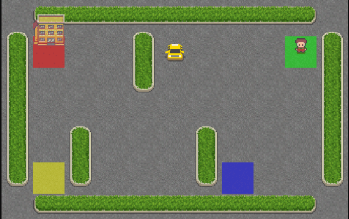
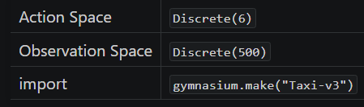

AMBIENTE OPENAI GYM TAXI V3

Este ambiente faz parte dos ambientes Toy Text, que contém informações gerais sobre o ambiente.

O Problema do Táxi envolve navegar até passageiros em um mundo em grade, pegá-los e deixá-los em um dos quatro locais.

Descrição
Existem quatro locais designados para embarque e desembarque (Vermelho, Verde, Amarelo e Azul) em uma grade 5x5. O táxi começa em um quadrado aleatório e o passageiro em um dos locais designados.

O objetivo é mover o táxi até o local do passageiro, pegar o passageiro, ir até o destino desejado pelo passageiro e deixá-lo lá. Assim que o passageiro é deixado, o episódio termina.

O jogador recebe recompensas positivas por deixar o passageiro no local correto. Recompensas negativas são dadas por tentativas incorretas de pegar/deixar o passageiro e para cada passo em que outra recompensa não é recebida.

Mapa:

    +---------+
    |R: | : :G|
    | : | : : |
    | : : : : |
    | | : | : |
    |Y| : |B: |
    +---------+
Do artigo “Hierarchical Reinforcement Learning with the MAXQ Value Function Decomposition” de Tom Dietterich [1].

Espaço de Ações
O formato da ação é (1,) no intervalo {0, 5}, indicando para qual direção mover o táxi ou pegar/deixar passageiros.

0: Mover para sul (baixo)

1: Mover para norte (cima)

2: Mover para leste (direita)

3: Mover para oeste (esquerda)

4: Pegar passageiro

5: Deixar passageiro

Espaço de Observação
Existem 500 estados discretos, pois há 25 posições possíveis do táxi, 5 possíveis locais do passageiro (incluindo o caso em que o passageiro está no táxi) e 4 locais de destino.

Os destinos no mapa são representados pela primeira letra da cor.

Locais dos passageiros:

0: Vermelho

1: Verde

2: Amarelo

3: Azul

4: No táxi

Destinos:

0: Vermelho

1: Verde

2: Amarelo

3: Azul

Uma observação é retornada como um int() que codifica o estado correspondente, calculado por ((taxi_row * 5 + taxi_col) * 5 + passenger_location) * 4 + destination

Note que existem 400 estados que podem ser realmente alcançados durante um episódio. Os estados ausentes correspondem a situações em que o passageiro está no mesmo local que seu destino, pois isso normalmente sinaliza o fim do episódio. Quatro estados adicionais podem ser observados logo após episódios bem-sucedidos, quando tanto o passageiro quanto o táxi estão no destino. Isso dá um total de 404 estados discretos alcançáveis.

Estado Inicial
O episódio começa com o jogador em um estado aleatório.

Recompensas
-1 por passo, a menos que outra recompensa seja acionada.

+20 ao entregar o passageiro.

-10 ao executar ações de “pegar” e “deixar” passageiro de forma ilegal.

Uma ação que resulta em noop, como mover para uma parede, incorrerá na penalidade de tempo. Noops podem ser evitados amostrando a action_mask retornada em info.

Fim do Episódio
O episódio termina se acontecer o seguinte:

Terminação: 1. O táxi deixa o passageiro.

Truncamento (ao usar o wrapper time_limit): 1. O comprimento do episódio é 200.

Informações
step() e reset() retornam um dicionário com as seguintes chaves:

p - probabilidade de transição para o estado.

action_mask - se as ações causarão uma transição para um novo estado.

Como o táxi não é estocástico, a probabilidade de transição é sempre 1.0. Implementar uma probabilidade de transição conforme o artigo de Dietterich (‘The fickle taxi task’) é um TODO.

Em alguns casos, realizar uma ação não terá efeito no estado do episódio. Na v0.25.0, info["action_mask"] contém um np.ndarray para cada uma das ações especificando se a ação mudará o estado.

Para amostrar uma ação modificadora, use action = env.action_space.sample(info["action_mask"]) Ou com um algoritmo baseado em Q-value action = np.argmax(q_values[obs, np.where(info["action_mask"] == 1)[0]]).

Argumentos
import gymnasium as gym
gym.make('Taxi-v3')

